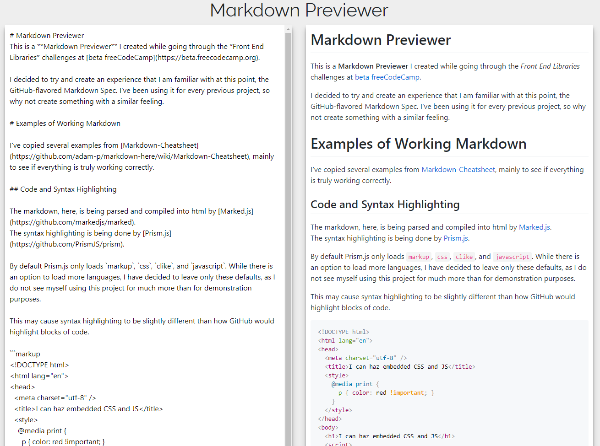

# Markdown Previewer

A markdown previewer built with React and Redux, I have created while going through the *Front End Framework Projects* on **beta freeCodeCamp**.

## [Front End Libraries](https://github.com/Squibs/freeCodeCamp#freecodecamp) (Go Back to My freeCodeCamp Repository)



### [Markdown Previewer](https://squibs.github.io/markdown-previewer/) (Click to view functional site)

**Completed April 23, 2018**

It's beginning to look like many of these first few React projects are going to end up having a simplistic design. I feel freeCodeCamp wants more focus on what is happening with React (and Redux). There was not a whole lot to spice up on this project aesthetic-wise, so I kept it simple again (coming from the a re-make of my quote-machine project).

The markdown here is being parsed and compiled into html by [Marked.js](https://github.com/markedjs/marked). The syntax highlighting for `<code>` blocks is handled using [Prism.js](https://github.com/PrismJS/prism). By default Prism.js only loads `markup`, `css`, `clike`, and `javascript`. While there is an option to load more languages, I have decided to leave only these defaults, as I do not see myself using this project for much more than for demonstration purposes.

This is the second project in which have used my own [Webpack boilerplate](https://github.com/Squibs/react-redux-boilerplate), and so far I have not run across too many issues, if any at all. I feel quite happy that I took the time to learn Webpack before getting into these projects, as it has really helped me understand exactly what is going on when working with Webpack.


## Future Note to Myself

In order to have all the freeCodeCamp test suite tests for this project to pass I had to edit `/node_modules/prismjs/prism.js`.

Lines at the time being: 210 and 217.

Snippet of modified code:

```JavaScript
// Set language on the element, if not present
element.className = element.className.replace(lang, '').replace(/\s+/g, ' ') + 'language-' + language; // !! CHANGED THIS

if (element.parentNode) {
  // Set language on the parent, for styling
  parent = element.parentNode;

  if (/pre/i.test(parent.nodeName)) {
    parent.className = parent.className.replace(lang, '').replace(/\s+/g, ' ') + 'language-' + language; // !! CHANGED THIS
  }
}
```

In the above I had to switch:

```JavaScript
.replace(/\s+/g, ' ') + ' language-' + language;
```

to (just removed the leading space):

```JavaScript
.replace(/\s+/g, ' ') + 'language-' + language;
```

Without this change the fCC test suite would not be able to detect the default markdown in the #editor field being rendered correctly on page load (test number 6 for Markdown Previewer tests). Before the change, the html would end up looking like (with the leading spaces in the class property): 

```
<pre class="  language-javascript><code class="  language-javascript></code></pre>
```
